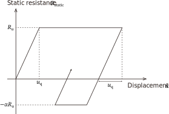

# PileWave

*Pile driving analysis based on the one-dimensional wave propagation using the finite element method*

This program is mostly based on the study by [Borja (1988)](https://www.sciencedirect.com/science/article/abs/pii/0266352X88900158).

## How to run

Use [REPL](@ref) or [Execution file (Windows)](@ref).

### REPL

#### Installation

```jl
pkg> registry add https://github.com/KeitaNakamura/KeitaNakamuraRegistry.git

pkg> add PileWave
```

#### Running simulations

```jl
julia> using PileWave

julia> PileWave.solve("input.toml")
```

### Execution file (Windows)

#### Downloads

Download execution file from [releases](https://github.com/KeitaNakamura/PileWave.jl/releases).

#### Running simulations

```sh
/path/to/PileWave.exe /path/to/input.toml
```

## Input

The input [TOML](https://toml.io/en/) file should be the following structure.

```@eval
using Markdown
toml = read("example.toml", String)
Markdown.parse("```toml\n" * toml * "```")
```

The above example file is [here](https://github.com/KeitaNakamura/PileWave.jl/blob/main/docs/src/example.toml).

### Input load data

`load.csv` must have `time` and `load` columns such as

```csv
time,load
0.0,0.0
0.1,239.00
0.2,478.00
[...]
```

where the intermediate values are linearly interpolated.

### Parameters for soil model

* `quake`: $u_\mathrm{q}$ (`inf`: slip)
* `yield_stress`: $R_\mathrm{u}$ (`0.0`: slip)
* `yield_factor`: $\alpha$ (`1.0` for shaft and `0.0` for bottom)
* `damping`: $C$ (`0.0`)

!!! info
    The values in bracket represent the default values.

## Output

The output data has following structure:

```text
output_directory
├── history # time history data (the same order as specified in input file)
│   ├── history_1.csv
│   ├── history_2.csv
│   ...
└── paraview # files to visualize waves in ParaView
    ├── fepile1d.pvd
    ├── fepile1d_1.vtu
    ...
```

## Soil model

The soil resistance is decomposed into static and dynamic components:

```math
\begin{aligned}
R &= R_\mathrm{static}(u) + R_\mathrm{dynamic}(\dot{u}) \\
  &= R_\mathrm{static}(u) + C \dot{u}
\end{aligned}
```

where ``R_\mathrm{static}`` is calculated based on the following friction model.

```@raw html

```
